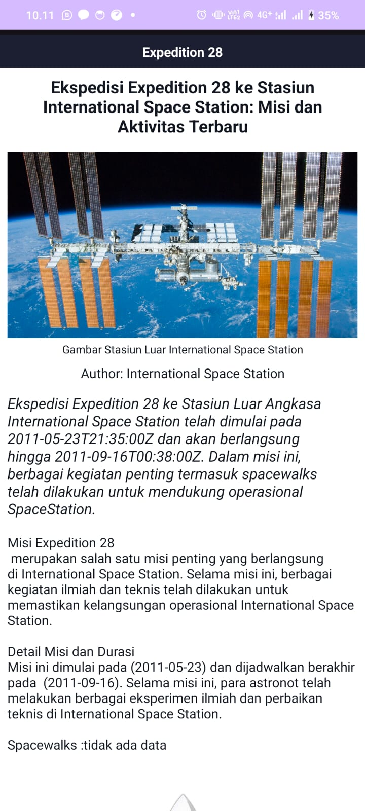
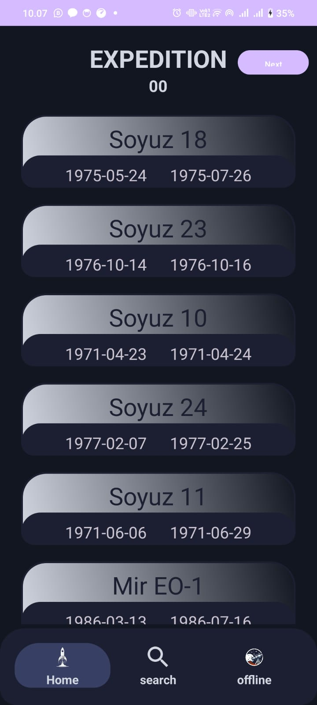
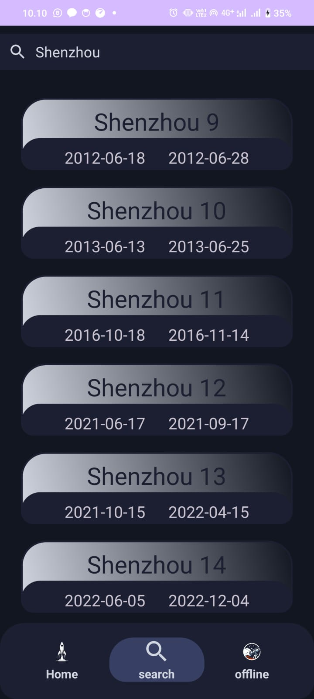
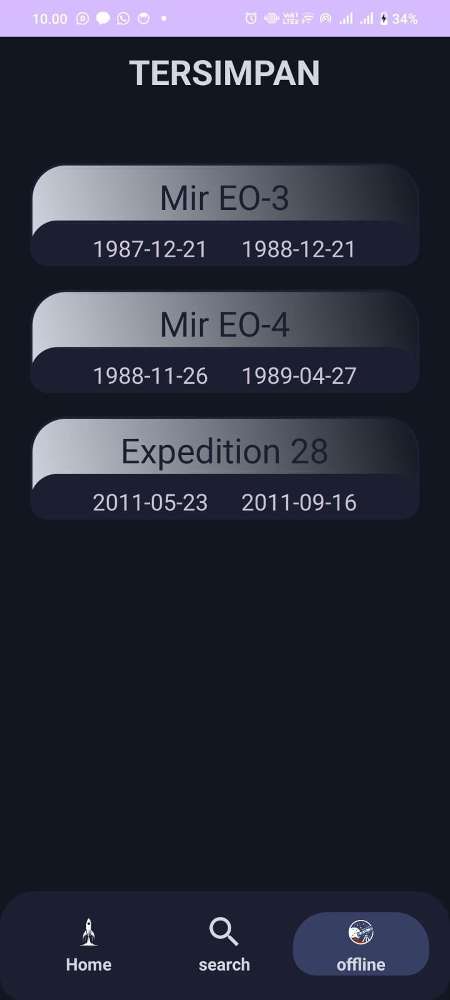

# I-Rocket

  

Selamat datang di aplikasi I-Rocket, sebuah platform inovatif yang dirancang untuk menghubungkan Anda dengan informasi terkini dan mendalam mengenai ekspedisi-ekspedisi luar angkasa. Dalam era penjelajahan antariksa yang semakin maju, informasi mengenai misi-misi yang dilakukan di luar angkasa menjadi sangat berharga. Aplikasi ini hadir untuk memenuhi kebutuhan tersebut, memberikan akses mudah dan cepat ke data ekspedisi, penemuan, dan perkembangan teknologi antariksa.

Melalui antarmuka yang user-friendly dan informatif, Anda dapat menjelajahi berbagai misi luar angkasa, mulai dari misi berawak hingga eksplorasi robotik di planet lain. Aplikasi ini juga menyediakan berita terbaru dan artikel mendalam memastikan Anda selalu mendapatkan informasi yang akurat dan up-to-date.

## Fitur Utama

- **Informasi Mengenai Expedisi Luar angkasa terbaru:**
  - Menyediakan data tentang expedisi yang telah dilakukan oleh berbagai macam lembaga.

- **Fitur Offline:**
  - Menyediakan data secara offline walaupun tanpa internet dengan cara menyimpan.
  
## Activity

    
    

 

Dapat dilihat bahwa aplikaih ini memiliki 2 activity yakni mainActivity yang akan menjadi tempat pertamakali user masuk ke aplikasih dan lalu di arahkan ke fragment home
dan juga terdapat Expedition Detail Activity yang berguna untuk memberikan informaasi lebih lanjut mengenai Expedisi yang dibuka 

## Fragment

    
    
    

 

### 1. Home
Adalah sebuah fargment yang berguna untuk menampilkan semua Expedition yang di akses dari API expedition 
### 2. Search
Adalah sebuah fargment yang berguna untuk menampilkan semua Expedition yang di akses dari API expedition sesui dengan quary pencarian
### 3. Home
Adalah sebuah fargment yang berguna untuk menampilkan semua Expedition yang telah di download oleh user tanpa menggunakan internet  

## Background Thread
Aplikasi ini dapat menjalankan operasi di latar belakang dengan memanfaatkan Executor dan Handler sehingga bisa meload data melalui backgroud sebelum  
ditampilkan di UInya 

## Networking
Terdapat implementasi fungsi untuk mengambil data yang berupa web_pages dari daftar universitas pada API eksternal menggunakan Retrofit, lalu menampilkan data tersebut ke dalam aplikasi
url api : https://ll.thespacedevs.com/2.2.0/expedition/

## Local Data Persistent
  - Menggunakan SharedPreference untuk menyimpan aktivitas yang dilakukan di aplikasih sehingga walapun aplikasih tertutup activitas sebelumnya tetap tersimpan.
  - Kami menyediakan data offline yang dapat diakses walaupun tanpa internet dari expedition yang disimpan pada sql lita dan di akses dengan Datasourch.java
 

Kami berharap aplikasi ini dapat menjadi jendela Anda ke alam semesta yang luas dan penuh misteri, membawa pengetahuan dan inspirasi dari luar angkasa ke genggaman Anda. Selamat menjelajah!
